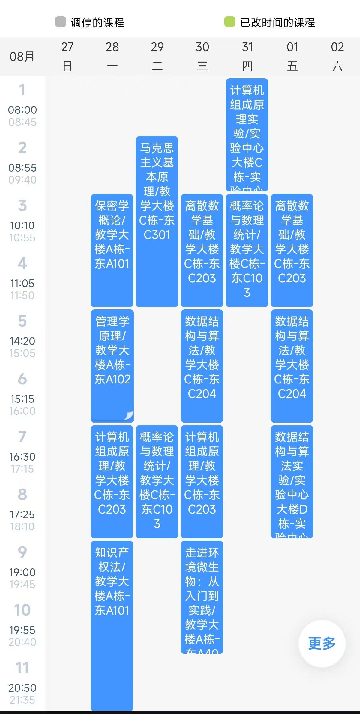

大二上的课程应该还是算偏多的，但是总体体验下来没有后续几个学期的压力大，而且这学期的很多课程也都是比较有趣的（毕竟脱离了数分、线代以及大物🤗🤗🤗）但是压力也不小，那么还是按照本人的课表来给大家一一介绍一下：

* 首先，是我们保密的第一个接触的文科也就是保密学概论（不清楚现在改成二次遴选后的是不是还是这样🧐）。我上这门课的时候，老师比较注重的是关于法律的考点，就连平时小测也会提前通知你是要考法律条文的填空，老师上课也不算是有趣就是中规中矩，给分也是中规中距，没什么好说的，就是老老实实上课就好了，为这个专业打好基础。（我猜老师还是依然会强调“一个机构，两块牌子”😉）
* 其次，是由管院老师组成的队伍给我们带来管理学，随着年级的增加你会发现这种其他学院上的管理学课程都是超级有趣的（老师颜值也都是超级高😋）是难得的休闲课并且也可以拓宽你的知识面。不过嘛，毕竟是管理学原理，老师上课会比较需要同学们的互动所以会经常提问以及小组展示什么的，然后期末考试要背诵的内容也都是超级超级多（而且是真的都会考😥），不过只要你背好了，成绩绝对不会低，非常适合临时抱佛脚。
* 接下来，就是重量级计算机组成原理了（这门课非常抽象），这个作为计算机专业的基础课确实难度是很大的，而且考试内容以及范围也是超级广，需要复习很久；感觉这门课主要靠自学还有做题，然后很依赖老师的上课质量（我的老师是郭雪梅老师，被誉为“郭神”；关于我们22级的计组考试时发生了很抓马的事情，这里就不赘述了）我们老师讲的很好也都比较基础，可以覆盖到全部领域，最重要的是老师讲的就是考试的；当时每个班级老师的讲课风格不统一，其他很多班级的老师讲的跟考试的完全不是同个东西。（我实在搞不懂为什么这个课的教学不能统一，非要分开来，最后考的东西又是统一的，结果很多班级的人连题目是什么意思都看不懂😡😡😡，还要老师现场教学，真的超级抽象）只要你掌握了考试的知识其他什么的都不用管就好了，所以要去借其他班级的PPT，那如果你们老师本身就很好，那很好了，就普通复习就可以游刃有余了。（我当时甚至最后一大章没复习完，但是全部都没考，然后反而考了个高分🥹，所以重要的是要掌握考试的考点，题目不会出很难的）
* 抽象的不仅仅是计组理论，计组实验更是重量级。首先，就是需要使用verliog语言（前提是你们老师不是那种很坏的，之前有个班是一个很怪的语言，但是我忘了），然后去让你自己搭建CPU，从单周期到流水线，过程还是挺折磨的。但是由于我们老师是**郭神**，她每次都会把代码发出来，然后让我们照着学或者是补空，就这样我们的基础就一下下好起来了，这门实验算是我自己很满意的实验了。（实现过程中，发现本人十分擅长，所以当时也是造福了班级一半以上的同学，并且实现了最多的指令集，所以大家可以放心参考）总之，就是多学多练吧，然后同学之间互帮互助就可以了。😉
* 接下来，是另外一个抽象的课程也就是概率论，这门课会让你用到之前的数分以及线代的知识，而且内容还是涉及很多的，难度也不小。需要注意的就是要好好写平时的练习题，这门课就是通过做题刷上来的也没什么好讲的，只要你肯比别人多付出点时间，这门课也是可以拿下的。（这里我不简述上课细节的原因是因为——我们老师上课很无聊，而且基本上一下课他走的比学生还快，你也问不了问题，但是老师上课质量还是有所保障的）
* 当然重量级还多着是呢，就比如这个离散数学，内容很多并且需要你自己去好好理解，因为内容多所以出题范围就广了，扎实基础是很重要的。（当时，我也没有复习完，但是考的大部分都是我没复习的，所以就踩雷了🥹🥹🥹），这门课主要注重的是个人的理解，也是需要付出很大的努力的。（因为内容真的太多啦！😨）
* 数据结构：这门课感觉就是程序设计的理论课而已，如果你代码基础好，这门课就是给你送的；但是如果你基础不太好，那需要好好复习的，因为考点也是很多，而且毕竟是算法，你只要理解错了，那你一整道题都是错的，所以也是注重个人理解并且也需要多多刷题，不然遇到不懂的题目一般都很难转过弯来。
* 数据结构实验：这个没啥，就是程序设计课，之前怎么学现在就怎么学就行了。
  看到现在，你应该会发现，这学期其实压力并不小，并且考试的科目内容都很多，并且题目也都不简单；所以不要做ddl战士，能临时抱佛脚的科目并不多，我最后很多科目都是没有复习完的，希望大家引以为鉴。

---------
  这学期其实专必加上体育就够你上的了（我甚至还没有算上马原），所以专选可以不用选，如果要选的话，你可能会看到一个课叫做知识产权法，这门课是真的非常抽象。基本上就只有前几节课是老师讲，后面全部都是同学上去讲，然后每节课都要pre都要做PPT，我差不多了做了10多个PPT就为了这一门课；所以，如果你不是很适合这方面的话，我建议是不要折磨自己了，咱就不选了。🫥（当然，如果你想提升自己的PPT技术也是可以选一下的，我就是在这门课练习的PPT技术，后面一直被老师夸奖，也算是一种提升吧）
