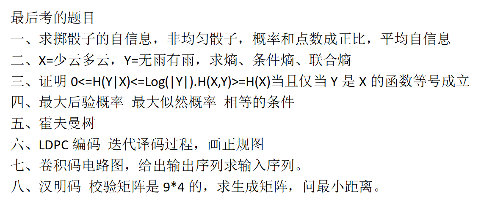

信息论这门课我个人感觉主要还是靠个人的课后理解吧（我们老师是马啸老师），老师上课的时候没有ppt，平时作业没有答案，所以每次做作业的时候都是一脸懵比的😥，不过好在后面找到学长、学姐要到了部分答案；然后我的答案正确率挺高但是也是有一些错误的，所以大家在参考的时候还是要有质疑精神的，不过那种很难的题目，我一般都是对的🤓。然后，我学习主要是靠上课听老师然后课后自己看录屏来自学的。录屏链接如下：https://docs.qq.com/sheet/DR1V3R3pxTElGRkpE

今年考试是多考了vertibe译码算法，其他的大致都是相同的。
